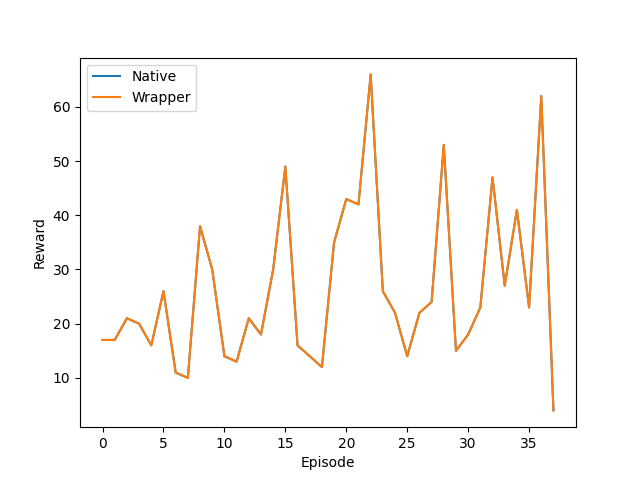

.. _Howto WP RL 002:
Howto RL-WP-002: Validation SB3 Wrapper (On-Policy) 
======================================================================

**Executable code**

.. literalinclude:: ../../../../../test/howtos/wrapper/howto_rl_wp_002_validation_wrapped_sb3_on_policy.py
	:language: python

**Results**

The result plot shows that MLPro's wrapper for Stable Baselines 3 behaves neutrally.

**Cross Reference**

    - :ref:`API Reference <api_basics>`