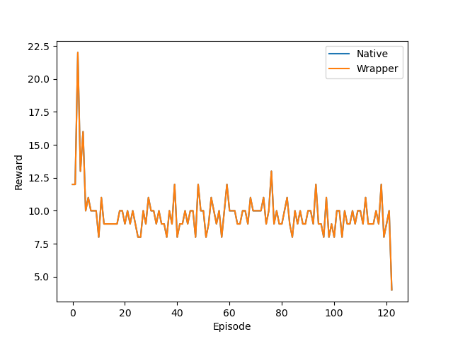

.. _Howto WP RL 003:
Howto RL-WP-003: Validation SB3 Wrapper (Off-Policy) 
======================================================================

**Executable code**

.. literalinclude:: ../../../../../test/howtos/wrapper/howto_rl_wp_003_validation_wrapped_sb3_off_policy.py
	:language: python

**Results**

The result plot shows that MLPro's wrapper for Stable Baselines 3 behaves neutrally.

**Cross Reference**

    - :ref:`API Reference <api_basics>`