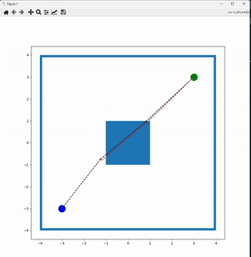
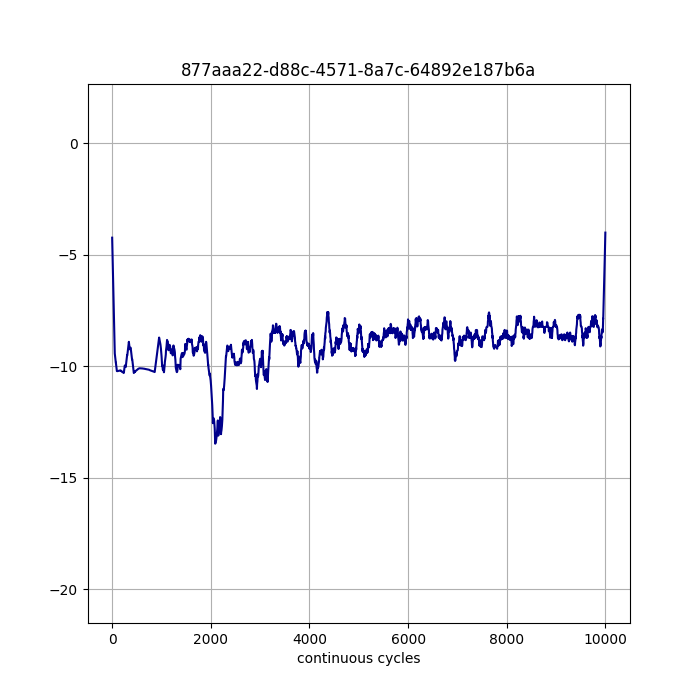

.. _Howto Env RL 003:
Howto RL-ENV-003: SB3 Policy on 2D Collision Avoidance Environment
======================================================================

**Executable code**

.. literalinclude:: ../../../../../test/howtos/env/howto_rl_env_003_train_agent_with_sb3_policy_on_2D_collision_avoidance_environment.py
	:language: python

**Results**

After the environment is initiated, the training will run for the specified amount of limits.
The training log is stored in the location specified and a figure plot similar to the figure 
above will be produced.

.. code-block:: bash

    YYYY-MM-DD  HH:MM:SS.SSSSSS  W  Results  "RL": ------------------------------------------------------------------------------ 
    YYYY-MM-DD  HH:MM:SS.SSSSSS  W  Results  "RL": -- Training Results of run 0
    YYYY-MM-DD  HH:MM:SS.SSSSSS  W  Results  "RL": ------------------------------------------------------------------------------
    YYYY-MM-DD  HH:MM:SS.SSSSSS  W  Results  "RL": ------------------------------------------------------------------------------
    YYYY-MM-DD  HH:MM:SS.SSSSSS  W  Results  "RL": -- Scenario          : RL-Scenario Trajectory Planning
    YYYY-MM-DD  HH:MM:SS.SSSSSS  W  Results  "RL": -- Model             : Agent 877aaa22-d88c-4571-8a7c-64892e187b6a
    YYYY-MM-DD  HH:MM:SS.SSSSSS  W  Results  "RL": -- Start time stamp  : 2024-07-17 11:13:20.816477
    YYYY-MM-DD  HH:MM:SS.SSSSSS  W  Results  "RL": -- End time stamp    : 2024-07-17 11:16:58.289306
    YYYY-MM-DD  HH:MM:SS.SSSSSS  W  Results  "RL": -- Duration          : 0:03:37.472829
    YYYY-MM-DD  HH:MM:SS.SSSSSS  W  Results  "RL": -- Start cycle id    : 0
    YYYY-MM-DD  HH:MM:SS.SSSSSS  W  Results  "RL": -- End cycle id      : 9999
    YYYY-MM-DD  HH:MM:SS.SSSSSS  W  Results  "RL": -- Training cycles   : 10000
    YYYY-MM-DD  HH:MM:SS.SSSSSS  W  Results  "RL": -- Evaluation cycles : 0
    YYYY-MM-DD  HH:MM:SS.SSSSSS  W  Results  "RL": -- Adaptations       : 8999
    YYYY-MM-DD  HH:MM:SS.SSSSSS  W  Results  "RL": -- High score        : None
    YYYY-MM-DD  HH:MM:SS.SSSSSS  W  Results  "RL": -- Training Episodes : 521
    YYYY-MM-DD  HH:MM:SS.SSSSSS  W  Results  "RL": -- Evaluations       : 0
    YYYY-MM-DD  HH:MM:SS.SSSSSS  W  Results  "RL": ------------------------------------------------------------------------------
    YYYY-MM-DD  HH:MM:SS.SSSSSS  W  Results  "RL": ------------------------------------------------------------------------------
    
The local result folder contains the training result files:
    - agent_actions.csv
    - env_rewards.csv
    - env_states.csv
    - evaluation.csv
    - summary.csv
    - trained model.pkl

**Cross Reference**

    - :ref:`API Reference <api_basics>`