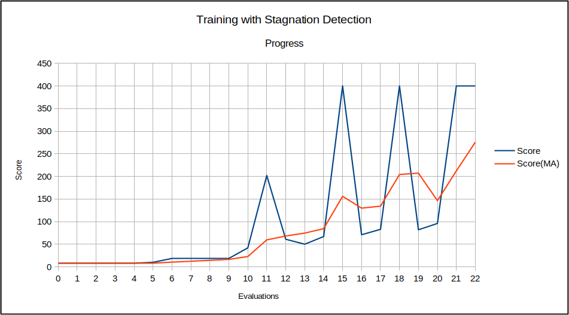

.. _Howto RL ATT 003:
Howto RL-ATT-003: Train and Reload Single Agent using Stagnation Detection Cartpole Continuous (MuJoCo)
======================================================================

**Executable code**

.. literalinclude:: ../../../../../test/howtos/att/howto_rl_att_003_train_and_reload_single_agent_mujoco_sd_cartpole_continuous.py
	:language: python

**Results**

The MuJoCo Cartpole environment window appears during training and shows an improved control behavior after a while. After the training, 
the related scenario is reloaded and run for a further episode to demonstrate the final control behavior.

The training itself is terminated due to automatic stagnation detection. The chart below shows the training progress and the 
ending at the point of maximum possible reward:

After termination the local result folder contains the training result files:
    - agent_actions.csv
    - env_rewards.csv
    - env_states.csv
    - evaluation.csv
    - summary.csv
    - scenario

**Cross Reference**

    - :ref:`API Reference <api_basics>`